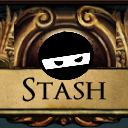

# poe.ninja stash tab view

Adds a stash tab view to supported poe.ninja price pages that overlays the price data where the item is in the stash.

## Supported pages

### Essences
[https://poe.ninja/challenge/essences](https://poe.ninja/challenge/essences)

### Fossils
[https://poe.ninja/challenge/fossils](https://poe.ninja/challenge/fossils)

### Fragments
[https://poe.ninja/challenge/fragments](https://poe.ninja/challenge/fragments)

### Scarabs
[https://poe.ninja/challenge/scarabs](https://poe.ninja/challenge/scarabs)

### Breach
[https://poe.ninja/challenge/fragments?tab=1](https://poe.ninja/challenge/fragments?tab=1)

## Known Issues

* [Does not always load](https://github.com/justinryder/poe-ninja-stash-tab-view/issues/7) - workaround: refresh the page until it does

## Installing and Running

### First time setup

1. Install the latest LTS version of [Node.js](https://nodejs.org/) **v14+**.
1. Run `npm install` to install the dependencies.
1. Run `npm start`
1. Load your extension on Chrome following:
   1. Access `chrome://extensions/`
   1. Check `Developer mode`
   1. Click on `Load unpacked extension`
   1. Select the `build` folder.
1. Happy selling.

### Reloading local changes

1. Run `npm start`
2. Make changes locally and save
3. Find extension in `chrome://extensions/`
4. Click the reload button
5. Load the page
